# Graph RAG — thiết kế (production)

> **Bổ sung vào lộ trình `PROMPT.md §47`** (đã thống nhất): hướng entity-graph
> với local traversal, graph lưu ở **Neo4j** (service riêng), chèn vào các
> phase quanh baseline.
>
> **Đây là tính năng production, không phải demo.** `GRAPH_RAG_ENABLED` chỉ là
> công tắc bật/tắt (graph RAG tốn LLM, nhiều hệ production gate sau flag) — khi
> bật thì phải chạy đúng, đủ độ tin cậy như phần còn lại của hệ thống: cập nhật
> tăng dần (incremental), dọn dẹp khi xoá tài liệu, chịu tải song song, có
> healthcheck, có fallback, có observability, có test đầy đủ.
> Community detection + global search: hoãn tới **P13**, thêm khi benchmark cho
> thấy câu hỏi chủ đề rộng cần (không bỏ hẳn — nằm trong roadmap).

## 0. Định nghĩa "production-ready" cho phần này

| Yêu cầu                                      | Cách đáp ứng                                                                                                                                                                                                                                 |
| -------------------------------------------- | -------------------------------------------------------------------------------------------------------------------------------------------------------------------------------------------------------------------------------------------- |
| **Incremental / idempotent**                 | Re-ingest tài liệu → xoá sạch phần graph của tài liệu đó rồi dựng lại, trong 1 transaction Neo4j. `Entity.mentionCount` / `documentIds` cập nhật đúng; entity mồ côi (không còn mention) bị xoá.                                             |
| **Xoá tài liệu → dọn graph**                 | `DELETE /documents/:id` (mới) gọi `GraphCleanupService` trước khi xoá ở Postgres. Có **job đối soát** (`graph:reconcile`) quét entity/edge trỏ tới documentId không còn tồn tại.                                                             |
| **Chịu tải song song**                       | Ghi Neo4j bằng `session.executeWrite` (tự retry lỗi transient/deadlock). MERGE theo `Entity.key` là idempotent. Ghi theo lô `UNWIND` (không mỗi entity 1 query). Advisory lock theo `documentId` cho re-graph song song.                     |
| **Neo4j chết / chậm**                        | Connection pool + timeout; `GraphRetriever` trả rỗng + log khi Neo4j lỗi (không chặn truy vấn RAG — §54). `Neo4jHealthIndicator` trong `/health` khi bật. Circuit-breaker nhẹ: sau N lỗi liên tiếp, tạm bỏ qua graph retrieval trong T giây. |
| **Chi phí có trần**                          | `GRAPH_EXTRACT_MAX_TOKENS` gộp chunk/lời gọi; `GRAPH_EXTRACT_MAX_LLM_CALLS_PER_DOC` trần cứng; cache extraction theo `sha256(chunkText + model + promptVersion)` (bảng `GraphExtractionCache`) — re-ingest cùng nội dung không gọi lại LLM.  |
| **Chất lượng extraction**                    | Prompt có ví dụ (few-shot), giới hạn loại thực thể; **gleaning** `GRAPH_EXTRACT_GLEANINGS` vòng (hỏi lại "còn sót không?") để tăng recall — như Microsoft GraphRAG. Structured output validate Zod, entity rỗng/không thuộc text bị loại.    |
| **Entity linking khi truy vấn thực sự khớp** | 3 tầng: (1) khớp tên thực thể là chuỗi con của query (rẻ, không LLM); (2) alias (bảng `EntityAlias`, thêm dần); (3) LLM rút thực thể từ query khi (1)+(2) rỗng. Không chỉ "exact normalized".                                                |
| **Traversal không nổ trên hub entity**       | `MATCH ... -[:RELATED*1..$hops]-` kèm degree-cap: bỏ đỉnh có degree > `GRAPH_MAX_ENTITY_DEGREE`; `LIMIT` đẩy xuống Cypher; timeout query.                                                                                                    |
| **Observability**                            | Cost extraction/tài liệu vào `IngestionJob` stage `GRAPH`. Trace truy vấn RAG có nhánh graph đầy đủ (seed entities, hops, entities/edges visited, chunkIds). Metric Prometheus-style sau (P12).                                              |
| **Test**                                     | Unit (resolution, extractor, retriever traversal, cleanup, cache); integration Neo4j thật (compose profile `graph`); e2e pipeline với `LLM_PROVIDER=fake` (tất định) — chạy trong CI không cần API key.                                      |
| **Bảo mật**                                  | Neo4j **luôn có mật khẩu** (kể cả dev/CI); bolt/http **không map ra host** trong compose (trừ khi dev cần). Query Cypher tham số hoá 100% (không nối chuỗi).                                                                                 |

## 1. Vì sao thêm Graph RAG

Vector search kém ở **multi-hop** (PROMPT §32 Type B — thông tin rải rác nhiều
chunk, không chunk nào chứa đủ) và ở **truy vết quan hệ** giữa các thực thể.
Graph RAG bù đắp:

- Truy hồi theo quan hệ: từ thực thể trong câu hỏi → mở rộng n-hop → gom chunk
  và đường quan hệ làm evidence.
- **Citation cấp thực thể / quan hệ** (P9): "X liên quan Y" truy về đúng chunk +
  câu khẳng định quan hệ, không chỉ một đoạn văn.
- Phát hiện **mâu thuẫn quan hệ** (§26): hai chunk khẳng định quan hệ khác nhau
  giữa cùng cặp thực thể → `CONFLICTING_EVIDENCE`.

Graph RAG **không** vào cấu hình baseline (§35 baseline là sàn tối thiểu). Nó là
một _retriever_ được **đo** so với baseline (Experiment: vector vs graph vs
hybrid — §36).

## 2. Kiến trúc

```mermaid
flowchart TD
  subgraph Ingestion["Ingestion — mở rộng ở P5"]
    CH[DocumentChunk] --> CACHE{Cache hit theo hash?}
    CACHE -->|co| RES
    CACHE -->|khong| EX["Entity/Relation Extractor: LLM structured + gleaning"]
    EX --> RES["Entity resolution: key = sha256 lower name + type"]
    RES --> W["UNWIND batch MERGE vao Neo4j (executeWrite, retry)"]
    W --> N4[(Neo4j)]
  end

  subgraph Retrieval["Retrieval — P6"]
    Q[Query] --> L1["1. Ten thuc the la chuoi con cua query"]
    L1 -->|rong| L2["2. Alias"]
    L2 -->|rong| L3["3. LLM rut thuc the tu query"]
    L1 & L2 & L3 --> SEED["Seed Entity.key trong Neo4j"]
    SEED --> TRV["Local traversal 1..hops, degree-cap, weight-sort, LIMIT"]
    TRV --> GC["Union chunkIds tren canh/dinh -> load chunk tu Postgres"]
    GC --> RC["RetrievedChunk[] source=graph, metadata.path"]
    Q --> VEC[Vector retriever]
    Q --> KW[Keyword retriever]
    VEC & KW & RC --> FUS["Fusion RRF/weighted -> Reranker -> Context"]
  end
```



### Nguồn sự thật

- **PostgreSQL** là nguồn sự thật cho document + chunk + embedding + cache + alias.
- **Neo4j** chứa: `Entity`, quan hệ `RELATED`, liên kết `Entity → Chunk`
  (`MENTIONED_IN`). **Không** nhân đôi nội dung chunk sang Neo4j — chỉ `chunkId`
  / `documentId` để join ngược về Postgres.
- Prisma không cascade sang Neo4j → mọi đường xoá document phải đi qua
  `GraphCleanupService`; thêm job đối soát định kỳ.

### Neo4j schema

```cypher
(:Entity {
  key,                      // sha256(lower(name)|type) — UNIQUE
  name, type, description,
  documentIds: [id],        // xuất hiện trong tài liệu nào
  mentionCount              // tổng số MENTIONED_IN — 0 => xoá entity
})
(:Chunk { id, documentId }) // mirror tối thiểu

(:Entity)-[:MENTIONED_IN { documentId }]->(:Chunk)
(:Entity)-[:RELATED {
  type, description,
  weight,                   // số chunk chứng thực (dùng để sort traversal)
  chunkIds: [id],           // để citation cấp quan hệ
  documentIds: [id]
}]->(:Entity)
```

Constraint + index (tạo lúc boot bởi `Neo4jSchemaService`, giống `VectorSchemaService`):

```cypher
CREATE CONSTRAINT entity_key   IF NOT EXISTS FOR (e:Entity) REQUIRE e.key IS UNIQUE;
CREATE CONSTRAINT chunk_id     IF NOT EXISTS FOR (c:Chunk)  REQUIRE c.id  IS UNIQUE;
CREATE INDEX      entity_name  IF NOT EXISTS FOR (e:Entity) ON (e.name);
CREATE INDEX      rel_docids   IF NOT EXISTS FOR ()-[r:RELATED]-() ON (r.documentIds);
```

## 3. Construction (PHASE 5)

### `src/graph/` — hạ tầng Neo4j

- `neo4j.service.ts` — bọc `neo4j-driver@6`: 1 `Driver` (pool) suốt vòng đời
  app, `executeRead`/`executeWrite` helper (retry transient tự động của driver
  - timeout của ta), `OnModuleDestroy` đóng driver. `GRAPH_RAG_ENABLED=false` →
    không khởi tạo driver; mọi method ném `GraphDisabledError` (caller đã guard).
- `neo4j-schema.service.ts` — `OnModuleInit`: tạo constraint/index (idempotent),
  log cảnh báo nếu Neo4j version < 5.
- `neo4j.health.ts` — `Neo4jHealthIndicator` cho `/health` (chỉ đăng ký khi bật).
- `graph.module.ts` — `@Global`, export `Neo4jService`.

### `src/rag/graph/` — nghiệp vụ

- `entity-extractor.service.ts` — `LlmService.chatStructured(messages, schema)`:
  - Schema Zod: `{ entities: [{ name, type ∈ GRAPH_ENTITY_TYPES, description }],
relationships: [{ source, target, type, description, strength: 1..10 }] }`.
  - Prompt (quản lý tập trung, có `promptVersion`): few-shot, "chỉ dùng text
    được cấp" (§23), loại quan hệ mở nhưng khuyến khích danh sách gợi ý.
  - **Gleaning**: lặp tối đa `GRAPH_EXTRACT_GLEANINGS` lần "còn thực thể/quan hệ
    nào bị bỏ sót không? Trả thêm, nếu không thì trả rỗng."
  - Post-validate: loại entity mà `name` không xuất hiện (chuẩn hoá) trong text;
    loại relationship có source/target không nằm trong danh sách entity.
  - Gộp chunk vào 1 lời gọi tới `GRAPH_EXTRACT_MAX_TOKENS`; trần
    `GRAPH_EXTRACT_MAX_LLM_CALLS_PER_DOC`.
- `entity-resolution.ts` — gộp theo `key`; merge `description` (nối, cắt theo độ
  dài, có thể tóm tắt bằng LLM ở bản sau); cộng dồn `weight`/`chunkIds`.
- `graph-write.service.ts` — nhận kết quả đã resolve, ghi Neo4j bằng `UNWIND`
  batch MERGE trong `executeWrite`. Thứ tự: MERGE Chunk → MERGE Entity (SET
  name/type/description, thêm documentId, `mentionCount += n`) → MERGE
  MENTIONED_IN → MERGE RELATED (SET/ADD weight, chunkIds).
- `graph-cleanup.service.ts` — `removeDocument(documentId)`:
  ```cypher
  MATCH (e:Entity)-[m:MENTIONED_IN {documentId:$d}]->(:Chunk {documentId:$d})
  DELETE m
  WITH e SET e.documentIds = [x IN e.documentIds WHERE x <> $d],
            e.mentionCount = e.mentionCount - 1
  ... // xoá RELATED có documentIds rỗng sau khi bỏ $d; xoá Entity mentionCount<=0; xoá Chunk mồ côi
  ```
  Chạy trong 1 transaction. `reconcile()` — quét toàn bộ, so với danh sách
  documentId hợp lệ từ Postgres.
- `graph-extraction-cache` — bảng Prisma `GraphExtractionCache { chunkHash,
model, promptVersion, entities Json, relationships Json, createdAt }`,
  `@@id([chunkHash, model, promptVersion])`.
- `graph-ingestion.service.ts` — orchestrator: load chunk → cache lookup →
  extract phần miss → resolve → advisory-lock theo doc → cleanup phần cũ của doc
  → write → ghi `IngestionJob` stage `GRAPH` `{ entityCount, relationshipCount,
llmCalls, cacheHits, inputTokens, outputTokens, estimatedCost, ms }`.

### State machine

Thêm `DocumentStatus.GRAPHING` (migration Prisma) giữa `EMBEDDING` và
`COMPLETED`. Khi `GRAPH_RAG_ENABLED=true`: `... → EMBEDDING → GRAPHING →
COMPLETED`. Khi tắt: `EMBEDDING → COMPLETED` như hiện tại (không đổi hành vi cũ).

`create()` / `reingest()`: sau embedding thành công, nếu bật thì gọi
`graphIngestion` **bọc try/catch** (giống `autoEmbed`) — lỗi extraction/Neo4j
**không** làm 500 cả request; trả `{ graph: { error } }`, doc giữ `GRAPHING`,
chạy lại qua `POST /documents/:id/graph`.

### API

- `POST /documents/:id/graph` — chạy/chạy lại graph construction (ném lỗi rõ
  ràng, khác nhánh auto).
- `GET /documents/:id/graph` — tóm tắt: entity/relationship count, top entity
  theo mentionCount, cost lần chạy gần nhất.
- `DELETE /documents/:id` — **mới**: cleanup graph → xoá chunk/embedding (cascade
  Postgres) → xoá document. (Cần cho cả test e2e đang xoá trực tiếp.)
- `POST /graph/reconcile` — job đối soát thủ công (sau này cron — P12).

## 4. Retrieval — GraphRetriever local (PHASE 6)

`src/rag/retrieval/graph-retriever.service.ts` implement chung interface
`Retriever` với `VectorRetriever` / `KeywordRetriever`:

1. **Query entity linking** (3 tầng ở §0). Kết quả: danh sách `Entity.key` +
   điểm khớp.
2. **Local traversal**:
   ```cypher
   MATCH (s:Entity) WHERE s.key IN $seeds
   MATCH path = (s)-[r:RELATED*1..$hops]-(n:Entity)
   WHERE all(x IN nodes(path) WHERE size((x)-[:RELATED]-()) <= $maxDegree)
   WITH path, reduce(w=0.0, rel IN relationships(path) | w + rel.weight) AS score
   ORDER BY score DESC LIMIT $topK
   RETURN path, score
   ```
3. **Gom evidence**: union `chunkIds` từ các cạnh `RELATED` + `MENTIONED_IN` của
   đỉnh đi qua → `SELECT * FROM "DocumentChunk" WHERE id = ANY($ids)` (Postgres)
   → `RetrievedChunk[]` với `source: 'graph'`, `score` (chuẩn hoá), `metadata:
{ seedEntities, entityPath, relationshipPath, hops }`.
4. Seed rỗng → trả `[]`. Neo4j lỗi / circuit mở → trả `[]` + log + tăng bộ đếm
   lỗi (PROMPT §54).

Fusion (P6): hợp nhất vector + keyword + graph bằng RRF hoặc weighted, `weight`
cấu hình (`FUSION_WEIGHT_*`). Reranker (P7) chấm lại top-N.

## 5. Citation cấp thực thể / quan hệ (PHASE 9, mở rộng)

Evidence-matcher, khi claim là một khẳng định quan hệ, thử map claim → cạnh
`RELATED` (theo cặp thực thể + loại) → `chunkIds` của cạnh → document/page.
`Citation` thêm biến thể `{ kind: 'relationship', source, target, relType,
chunkId, documentId, page }`. Không map được → citation không hợp lệ (§29).

## 6. Config

```env
GRAPH_RAG_ENABLED=false
NEO4J_URI=bolt://localhost:7687
NEO4J_USER=neo4j
NEO4J_PASSWORD=                       # luôn bắt buộc khi GRAPH_RAG_ENABLED=true
NEO4J_MAX_POOL_SIZE=50
NEO4J_QUERY_TIMEOUT_MS=15000

GRAPH_EXTRACT_MAX_TOKENS=3000
GRAPH_EXTRACT_GLEANINGS=1
GRAPH_EXTRACT_MAX_LLM_CALLS_PER_DOC=40
GRAPH_ENTITY_TYPES=PERSON,ORG,LOCATION,DATE,REGULATION,CONCEPT,EVENT,PRODUCT
GRAPH_PROMPT_VERSION=1

GRAPH_MAX_HOPS=2
GRAPH_MAX_ENTITY_DEGREE=200
GRAPH_RETRIEVAL_TOP_K=10
GRAPH_LINK_USE_LLM=true               # tầng 3 entity linking

FUSION_WEIGHT_VECTOR=1.0
FUSION_WEIGHT_KEYWORD=0.7
FUSION_WEIGHT_GRAPH=0.8
```

`env.schema.ts`: `GRAPH_RAG_ENABLED=true` ⇒ `NEO4J_URI` + `NEO4J_PASSWORD` bắt
buộc (cross-field refine, giống ràng buộc provider LLM).

## 7. Docker

`docker-compose.yml` thêm service `neo4j` (`neo4j:5-community`):

- `NEO4J_AUTH=neo4j/<password cố định trong .env>` — **có auth kể cả dev**.
- Healthcheck: `cypher-shell -u neo4j -p $PASS "RETURN 1"`.
- Volume `neo4jdata`; **không** map 7687/7474 ra host mặc định (thêm ở
  `docker-compose.override.yml` khi dev cần Neo4j Browser).
- Đặt trong **compose profile `graph`** → `docker compose up -d` (không profile)
  vẫn chạy stack cơ bản; `docker compose --profile graph up -d` để bật Neo4j.
- App container: `depends_on` neo4j chỉ khi profile `graph` active.

## 8. Test

| Loại                     | Nội dung                                                                                                                                                                                                                                                                                                                                            |
| ------------------------ | --------------------------------------------------------------------------------------------------------------------------------------------------------------------------------------------------------------------------------------------------------------------------------------------------------------------------------------------------- |
| Unit                     | entity-resolution (gộp key, merge weight/desc); extractor (mock `LlmService` → structured, gleaning loop, post-validate loại entity bịa); graph-write (UNWIND params đúng); graph-cleanup (mentionCount, xoá orphan); cache hit/miss; graph-retriever (mock `Neo4jService` — seed linking 3 tầng, degree-cap, gom chunkIds); fusion với graph input |
| Integration (Neo4j thật) | `docker compose --profile graph up -d neo4j`; MERGE idempotent (chạy 2 lần cùng data → count không đổi); re-graph 1 doc; cleanup 1 doc trong đồ thị nhiều doc; traversal 2-hop; skip khi thiếu `NEO4J_URI`                                                                                                                                          |
| E2E                      | `LLM_PROVIDER=fake` + `EMBEDDING_PROVIDER=fake` + `GRAPH_RAG_ENABLED=true`: `POST /documents` → status `COMPLETED`, `GET /:id/graph` có entity/relationship, `DELETE /:id` dọn sạch Neo4j                                                                                                                                                           |

**`fake` LLM provider** (`LLM_PROVIDER=fake`) — thêm ở P5, đối xứng với `fake`
embedding: `chat` trả câu cố định; `chatStructured` sinh output tất định khớp
schema (với schema extraction: NER thô — cụm từ viết hoa liên tiếp → entity;
đồng xuất hiện trong 1 câu → relationship). Cho phép CI chạy **toàn bộ** pipeline
graph + (P4) baseline generation mà không cần API key. Production dùng LLM thật.

## 9. Cost & observability (§38, §56)

- Ingestion: `IngestionJob.GRAPH.metrics` = `{ llmCalls, cacheHits, inputTokens,
outputTokens, estimatedCost, entityCount, relationshipCount, ms }`.
- RAG query trace (P11): nhánh `graph` = `{ seedEntities, linkMethod, hops,
entitiesVisited, edgesVisited, chunkIds, latencyMs, neo4jUp }`.
- Regression (P12): theo dõi cost extraction/tài liệu **và** delta
  Recall@K / Context Precision / Faithfulness của `hybrid+graph` vs `hybrid` vs
  `vector-only`. Nếu graph không cải thiện đủ để bù cost → tắt qua flag, giữ code.

## 10. Trade-off đã chấp nhận

|                 |                                                                                                                                           |
| --------------- | ----------------------------------------------------------------------------------------------------------------------------------------- |
| **+**           | Multi-hop tốt hơn; citation cấp quan hệ; phát hiện mâu thuẫn quan hệ                                                                      |
| **−**           | Thêm 1 service (Neo4j) — user chọn có chủ đích; cô lập sau `GRAPH_RAG_ENABLED` + compose profile                                          |
| **−**           | Extraction tốn LLM — giảm bằng gộp chunk + cache theo hash + trần cứng                                                                    |
| **−**           | Chất lượng graph phụ thuộc LLM extraction — đo bằng golden set có annotation quan hệ (P11)                                                |
| Hoãn (không bỏ) | Leiden community detection + global search (map-reduce community summaries) → **P13**, bật khi benchmark cho thấy câu hỏi chủ đề rộng cần |
