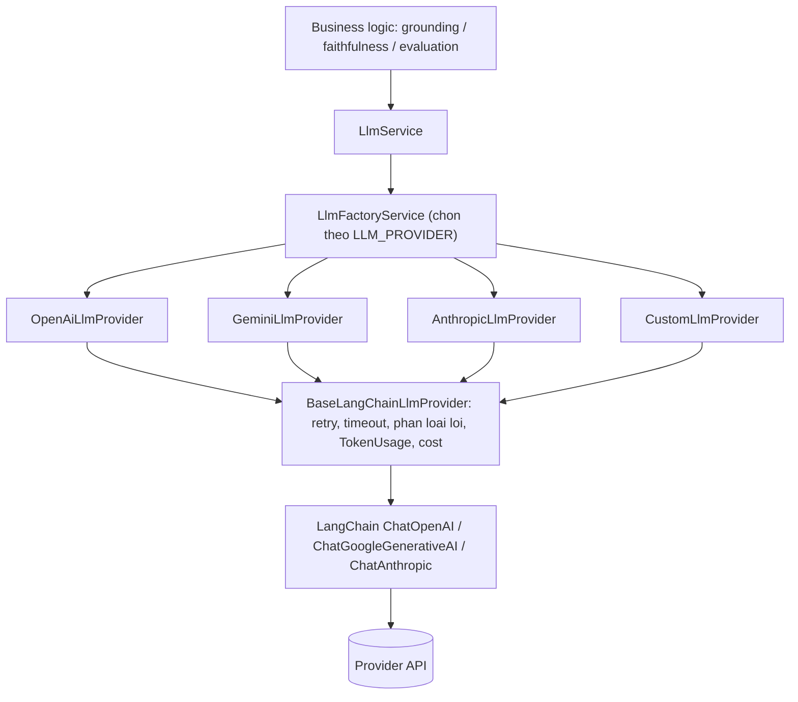

# Kiến trúc Multi-Provider LLM

## 1. Vấn đề

RAG pipeline, evaluation và benchmark phải hoạt động **giống hệt nhau** bất kể
dùng provider nào (OpenAI, Gemini, Anthropic, hay endpoint tự host tương thích
OpenAI). Yêu cầu:

- Đổi provider chỉ bằng **environment variable**, không sửa code.
- Token / cost tracking **thống nhất** giữa các provider (pricing khác nhau).
- Error handling, retry, timeout **thống nhất**.
- Business logic (grounding, faithfulness, citation) **không bao giờ** tham
  chiếu tới một provider cụ thể hay một class của LangChain.

## 2. Giải pháp: interface + factory



Tương tự cho embedding: `EmbeddingService` → `EmbeddingFactoryService` →
`{OpenAi,Gemini,Custom}EmbeddingProvider` → `BaseLangChainEmbeddingProvider`.

### Interface cốt lõi (`src/ai/llm/llm.interface.ts`)

```ts
interface LLMProvider {
  readonly provider: LlmProvider; // OPENAI | GEMINI | ANTHROPIC | CUSTOM
  readonly defaultModel: string;
  isConfigured(): boolean;
  chat(messages, options?): Promise<LLMResponse>;
  chatStream(messages, options?): AsyncIterable<LLMStreamChunk>;
  chatStructured<T>(
    messages,
    zodSchema,
    options?,
  ): Promise<StructuredResult<T>>;
}
```

`LLMResponse` luôn kèm `usage: { inputTokens, outputTokens, totalTokens, estimatedCost }`,
`model`, `provider`, `latencyMs`, `finishReason`.

## 3. Vì sao wrap LangChain thay vì dùng trực tiếp

Ta dùng `ChatOpenAI` / `ChatGoogleGenerativeAI` / `ChatAnthropic` của LangChain
để không phải tự viết HTTP client cho từng provider, **nhưng** bọc chúng sau
interface của mình để:

- Thống nhất `TokenUsage` (LangChain trả `usage_metadata` theo format khác nhau,
  đôi khi ở `response_metadata`).
- Thống nhất retry (ta tắt `maxRetries` của LangChain, tự xử lý bằng
  `withRetry` — exponential backoff + full jitter, có giới hạn).
- Thống nhất phân loại lỗi (`classifyProviderError`).
- Validate lại structured output bằng Zod ở phía ta (không tin việc provider
  tự ép schema — PROMPT §50).
- Dễ swap sang implementation khác (SDK trực tiếp, hoặc mock trong test).

## 4. Cấu hình (biến môi trường)

```env
LLM_PROVIDER=openai            # openai | gemini | anthropic | custom
EMBEDDING_PROVIDER=openai      # openai | gemini | custom

OPENAI_API_KEY=...             OPENAI_CHAT_MODEL=gpt-4o
GEMINI_API_KEY=...             GEMINI_CHAT_MODEL=gemini-2.5-flash
ANTHROPIC_API_KEY=...          ANTHROPIC_CHAT_MODEL=claude-sonnet-4-20250514
CUSTOM_LLM_BASE_URL=...        CUSTOM_LLM_MODEL=...        CUSTOM_LLM_API_KEY=...

EMBEDDING_DIMENSION=1536       # phải khớp model đang dùng
LLM_TIMEOUT_MS=60000  LLM_MAX_RETRIES=3  LLM_RETRY_BASE_DELAY_MS=500
```

`env.schema.ts` validate lúc boot: provider đang chọn **bắt buộc** có key/URL
tương ứng, nếu không Nest từ chối khởi động.

## 5. Phân loại lỗi theo provider (PROMPT §52)

| Kind                  | Retry? | Nguồn điển hình                             |
| --------------------- | ------ | ------------------------------------------- |
| `RATE_LIMIT`          | ✅     | HTTP 429, "rate limit" (mọi provider)       |
| `OVERLOADED`          | ✅     | HTTP 529, "overloaded" (Anthropic)          |
| `QUOTA`               | ❌     | "quota", "resource_exhausted" (Gemini)      |
| `SAFETY_BLOCK`        | ❌     | "safety", "blocked", "recitation" (Gemini)  |
| `TOKEN_LIMIT`         | ❌     | "context length", "max_tokens" (OpenAI…)    |
| `AUTH`                | ❌     | HTTP 401/403                                |
| `SERVER_ERROR`        | ✅     | HTTP 5xx                                    |
| `NETWORK` / `TIMEOUT` | ✅     | ECONNRESET, ETIMEDOUT, quá `LLM_TIMEOUT_MS` |
| `BAD_REQUEST`         | ❌     | HTTP 400/422                                |

## 6. Cost estimation (`src/ai/llm/pricing.ts`)

Bảng giá USD / 1K token theo từng model; model chưa biết dùng giá mặc định của
provider (không bao giờ để cost = 0 âm thầm). Provider `custom` mặc định giá 0
(tự host). Mỗi experiment/benchmark ghi rõ **provider + model** đã dùng.

Đếm token: `js-tiktoken` với `cl100k_base` làm chuẩn chung — chính xác cho
OpenAI, xấp xỉ sát cho Gemini/Anthropic. Sẽ tinh chỉnh bằng API count nếu cần.

## 7. Endpoint kiểm tra

- `GET /ai/providers` — liệt kê provider LLM/embedding, model mặc định,
  provider nào đang active, provider nào đã có credentials, `EMBEDDING_DIMENSION`.
- `POST /ai/providers/test` — `{ "provider": "gemini", "mode": "chat" }` — gọi
  thật một vòng tối thiểu, trả `{ ok, configured, latencyMs, model, tokens, error? }`.
  Không bao giờ ném lỗi: provider chưa cấu hình → `{ ok: false }`.

## 8. Prisma 7 + driver adapter

`PrismaService` dùng generator `prisma-client` (Prisma 7) + driver adapter
`@prisma/adapter-pg` theo docs Prisma mới nhất:

- `prisma/schema.prisma`: chỉ `datasource db { provider = "postgresql" }`,
  không còn `url`.
- `prisma.config.ts`: `datasource.url` đọc từ `process.env.DATABASE_URL`.
- Client sinh vào `src/generated/prisma` (git-ignored, `moduleFormat = "cjs"`).
- `new PrismaClient({ adapter: new PrismaPg({ connectionString }) })`.

pgvector: Prisma không có kiểu `vector` native → cột `Embedding.embedding` khai
báo `Unsupported("vector")`, mọi I/O vector qua `$queryRaw` / `$executeRaw`.
Extension `vector` do migration của Prisma tạo. ANN index (`ivfflat`/`hnsw`)
hoãn tới PHASE 3 khi đã có dữ liệu và biết số chiều.
