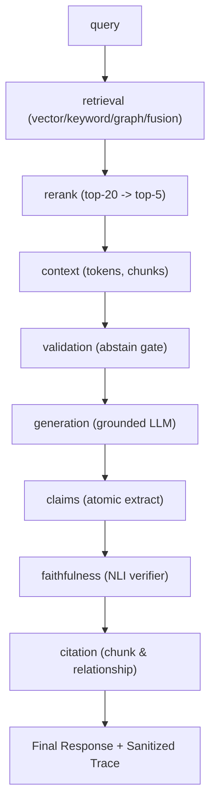

# Full-Pipeline Observability & Tracing (PHASE 12)

> Quy chuẩn theo dõi, thu thập telemetry và truy vết toàn diện vòng đời truy vấn RAG
> (PROMPT §38).
>
> **Agent** (PHASE 18) có lớp observability riêng: `Tracer` interface
> (`src/observability/tracer.ts`) + `LangfuseTracer` adapter — `AgentService`
> KHÔNG import Langfuse trực tiếp. Trace agent ghi `providerId`/`toolId`/
> `errorCode` mỗi tool call. Xem `implementation-report.md §11`.

## 1. Mục tiêu

Mỗi truy vấn RAG trong hệ thống phải có khả năng:
- **Truy vết toàn diện (End-to-End Trace)** qua từng chặng: Query analysis → Vector/Keyword/Graph Retrieval → Fusion → Reranking → Context Builder → Context Validation → Answer Generation → Claim Extraction → Faithfulness Verifier → Citation Mapping.
- **Đo lường định lượng**: Latency từng chặng (ms), Token Usage (input, output, embedding), Estimated Cost (\$).
- **Bảo mật tuyệt đối (Zero-Secret Leakage)**: Mọi thông tin nhạy cảm (API Keys, Bearer tokens, passwords) đều được khử sạch (`[REDACTED]`) qua `trace-sanitizer.util.ts` trước khi lưu vào DB hoặc log ra ngoài.

---

## 2. Vòng đời Tracing từng Stage (PROMPT §38)



---

## 3. Cấu trúc Trace Object (`RagQuery.trace`)

```jsonc
{
  "totalLatencyMs": 320,
  "retrieval": {
    "strategy": "hybrid",
    "vectorChunks": 5,
    "keywordChunks": 4,
    "graphChunks": 2,
    "fusionMethod": "rrf",
    "fusedChunks": 8,
    "latencyMs": 45
  },
  "rerank": {
    "enabled": true,
    "method": "llm",
    "fellBack": false,
    "in": 8,
    "out": 5,
    "latencyMs": 110
  },
  "context": {
    "chunks": 5,
    "totalTokens": 1420
  },
  "validation": {
    "proceed": true,
    "topScore": 0.94,
    "chunkCount": 5,
    "mode": "strict"
  },
  "generation": {
    "latencyMs": 125,
    "citedIndexes": [1, 2],
    "groundingRatio": 0.96,
    "downgraded": false,
    "regenerated": false
  },
  "citation": {
    "claimCount": 2,
    "supportedClaims": 2,
    "chunkCitations": 2,
    "relationshipCitations": 0
  },
  "faithfulness": {
    "score": 1.0,
    "grounded": true,
    "method": "heuristic",
    "latencyMs": 2
  }
}
```

---

## 4. API Tra cứu & Audit

- **`GET /rag/queries`**: Liệt kê danh sách các truy vấn gần đây (hỗ trợ query param `take`, `status`).
- **`GET /rag/queries/:id`**: Chi tiết truy vấn, câu trả lời, citations và claims đã đối chiếu.
- **`GET /rag/queries/:id/trace`**: Trích xuất chi tiết timeline và telemetry của truy vấn phục vụ debug.
