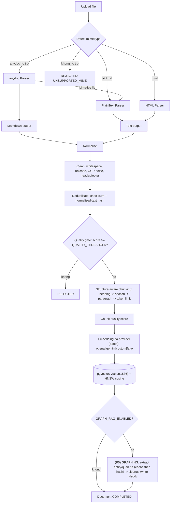
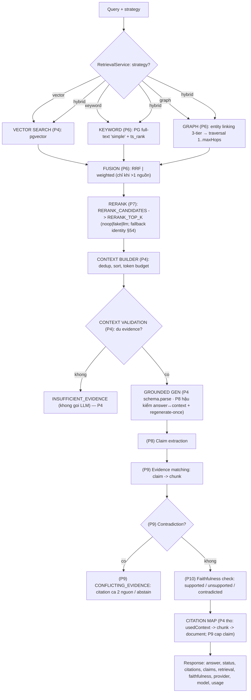

# Kiến trúc RAG Reliability Service

> Tài liệu này mô tả kiến trúc tổng thể và triết lý thiết kế. Chi tiết từng
> thành phần (cleaning, chunking, retrieval, grounding, evaluation…) sẽ được
> bổ sung theo từng phase (xem `PROMPT.md §47`).

## 1. Triết lý

RAG **không** nhằm mục tiêu "LLM luôn trả lời". Mục tiêu là:

> LLM trả lời **đúng khi có evidence** và **biết từ chối khi không có evidence**.

Khi knowledge base không chứa thông tin, hệ thống phải trả về
`INSUFFICIENT_EVIDENCE` — không đoán, không bịa, không suy luận vượt evidence,
không tạo citation giả.

Mọi tối ưu phải được chứng minh bằng số liệu (baseline → experiment →
regression), không nói "cách này tốt hơn" mà phải "Recall@5 tăng X→Y,
Faithfulness tăng A→B, latency +C ms, cost +D%".

## 2. Trạng thái theo phase

> Lộ trình gốc = `PROMPT.md §47`. Đã chèn **Graph RAG** (entity graph + local
> traversal, lưu Neo4j) — dời P5-P12 xuống 1 bậc; graph retriever ghép vào
> phase retrieval. Xem `docs/architecture/graph-rag.md`.

| Phase | Nội dung                                                                                                    | Trạng thái    |
| ----- | ----------------------------------------------------------------------------------------------------------- | ------------- |
| 0     | Bootstrap: Nest · Prisma 7 · PostgreSQL · pgvector · Docker · config · health · multi-provider LLM · anydoc | ✅ Hoàn thành |
| 1     | Ingestion: parsing, normalize, cleaning, dedup, quality score, API upload/CRUD                              | ✅ Hoàn thành |
| 2     | Chunking: structure-aware (Markdown) + fixed (baseline) + chunk quality + API                               | ✅ Hoàn thành |
| 3     | Embedding đa provider (batch) + pgvector + HNSW index + API                                                 | ✅ Hoàn thành |
| 4     | Baseline RAG: vector retrieval → context → validate → generate + evaluation harness + golden dataset + baseline metrics | ✅ Hoàn thành |
| 5     | **Graph RAG — construction**: entity + relationship extraction (LLM + gleaning) → Neo4j; cache theo hash; ingestion stage `GRAPH`; cleanup/reconcile idempotent; API | ✅ Hoàn thành |
| 6     | Retrieval nâng cao: metadata filter · keyword (PG full-text) · **graph traversal (local, 3-tier entity linking, degree-cap, circuit-breaker)** · hybrid · fusion (RRF/weighted) · `strategy` per-request | ✅ Hoàn thành |
| 7     | Reranking: noop/fake/LLM-listwise provider + fallback identity (§54) + `POST /evaluation/benchmark-rerank` (before/after) | ✅ Hoàn thành |
| 8     | Grounded generation + abstention: prompt siết + hậu kiểm answer↔context (hàm thuần) + CONFLICTING_EVIDENCE + regenerate-once + `RAG_STRICT_GROUNDING` + `POST /evaluation/benchmark-grounding` | ✅ Hoàn thành |
| 9     | Citation: claim → evidence → chunk/**entity/relationship** → document                                       | ⏳            |
| 10    | Faithfulness: claim extraction, evidence matching, contradiction                                            | ⏳            |
| 11    | Evaluation framework: golden dataset, metrics, experiments                                                  | ⏳            |
| 12    | Regression + observability                                                                                  | ⏳            |
| 13    | Benchmark đa provider + **vector vs graph vs hybrid** (quality / cost / latency)                            | ⏳            |

## 3. Cấu trúc module

```
src/
├── config/         # ConfigModule + validate env bằng Zod (env.schema.ts)
├── database/        # PrismaService (Prisma 7 + driver adapter @prisma/adapter-pg)
├── documents/       # upload/CRUD tài liệu + parsers (anydoc + fallback)
├── rag/ingestion/   # normalize · clean · dedup · quality · orchestrator
├── rag/chunking/    # structure-aware | fixed · chunk quality · factory
├── rag/embedding/   # orchestrator (chunk→pgvector) + kiểm tra vector schema
├── rag/retrieval/   # Retriever interface · VectorRetriever (P4) · KeywordRetriever (P6, PG full-text) · GraphRetriever + GraphEntityLinker (P6) · fusion.ts (RRF/weighted, thuần) · RetrievalService (dispatch strategy + fusion)
├── rag/context/     # ContextBuilder (dedup·sort·token budget) · ContextValidator (abstain gate §22, strict P8)
├── rag/grounding/   # AnswerGeneration (structured output §50 · P8 hậu kiểm) · grounding-checks.ts (thuần); claim/faithfulness ở P9-10
├── rag/pipeline/    # (P4) RagPipelineService: retrieve→context→validate→generate→persist RagQuery
├── rag/graph/       # (P5) EntityExtractor (LLM+gleaning) · entity-resolution (thuần) · GraphWrite (UNWIND MERGE) · GraphCleanup (removeDoc/reconcile) · GraphExtractionCache · GraphIngestion (orchestrator) · GraphController (/graph/reconcile); graph traversal ở P6
├── graph/           # (P5) Neo4jService (driver pool, read/write/writeTx) · Neo4jSchemaService (constraint/index) · Neo4jHealthIndicator · graph.module (@Global)
├── evaluation/      # (P4) golden dataset loader · retrieval + generation metrics · EvaluationRun · CLI
├── ai/
│   ├── llm/         # LLMProvider interface + 5 provider (openai|gemini|anthropic|custom|fake)
│   ├── embeddings/  # EmbeddingProvider interface + 4 provider (openai|gemini|custom|fake)
│   ├── reranking/   # (P7) RerankerProvider (noop|fake|llm-listwise) · factory · RerankerService (fallback identity §54)
│   └── tokenizer/   # đếm token (js-tiktoken)
├── documents/parsers/  # anydoc (chính) + plaintext/html (fallback)
├── common/         # errors, types (pipeline contracts §53), utils, constants
└── health/         # /health (db + pgvector), /health/live
```

## 4. Pipeline ingestion tài liệu (mục tiêu — hiện thực dần từ PHASE 1)



> Bước GRAPHING bọc try/catch (giống autoEmbed): Neo4j/extraction lỗi KHÔNG làm
> hỏng request — document + chunk + embedding vẫn hợp lệ, doc giữ ở `GRAPHING`,
> chạy lại qua `POST /documents/:id/graph`. Xem `docs/architecture/graph-rag.md`.

## 5. Pipeline truy vấn RAG (`POST /rag/query`)

Đã hiện thực (P4 vector · P6 keyword/graph/hybrid/fusion · P7 rerank): retrieval
theo `strategy` → (hybrid) fusion → (RERANK_ENABLED) rerank → context builder →
context validation → grounded generation → citation map thô → response.
Đường xám (P9-10): claim extraction, evidence matching, contradiction,
claim-level faithfulness. Query analyzer: hoãn (client chọn `strategy` trực tiếp).



> `strategy` mặc định = `RETRIEVAL_STRATEGY` (env), ghi đè bằng field `strategy`
> trong body `POST /rag/query|search`. `hybrid` chạy 3 nguồn SONG SONG; nguồn nào
> lỗi hạ tầng thì fusion vẫn tiếp với nguồn còn lại, chỉ báo `error` toàn cục khi
> MỌI nguồn fail (PROMPT §54). Claim/faithfulness vẫn ở P8-10 (`claims:
> []`, `faithfulness: null`). Xem `docs/rag/retrieval.md`.

## 6. Failure handling (PROMPT §54)

| Stage             | Khi lỗi                                                                                                                                                        |
| ----------------- | -------------------------------------------------------------------------------------------------------------------------------------------------------------- |
| Parser (anydoc)   | thử fallback parser → vẫn lỗi → `INGESTION_FAILED` với lý do cụ thể (`NEEDS_OCR`, `ENCRYPTED`, `MALFORMED`…)                                                   |
| Quality gate      | `REJECTED`                                                                                                                                                     |
| Embedding         | provider chưa cấu hình → bỏ qua (dừng `CHUNKING`); số chiều lệch → `INGESTION_PRECONDITION`; API lỗi → retry giới hạn rồi ném (giữ `EMBEDDING`, re-embed được) |
| Graph (P5)        | `GRAPH_RAG_ENABLED=false` → bỏ qua; Neo4j chết / extraction lỗi → ghi `IngestionJob(GRAPH, FAILED)`, giữ doc ở `GRAPHING` (chạy lại `POST /:id/graph`), request KHÔNG 500. Explicit endpoint ném lỗi rõ ràng. |
| Vector retriever  | lỗi hạ tầng (embed query fail) → `trace.error`; nếu là nguồn duy nhất → HTTP 502, KHÔNG che thành `INSUFFICIENT_EVIDENCE`; trong `hybrid` fusion vẫn chạy với keyword/graph |
| Keyword retriever | `websearch_to_tsquery` rỗng → `trace.reason`, 0 kết quả (không lỗi); lỗi DB → `trace.error`                                                                     |
| Graph retriever   | graph tắt / seed rỗng → `trace.reason`, 0 kết quả; Neo4j chết → `trace.error` + circuit-breaker (3 lỗi liên tiếp → bỏ qua 30s); không bao giờ ném (hợp đồng `Retriever`) |
| Fusion            | chỉ 1 nguồn có kết quả → pass-through (không đổi score/source); mọi nguồn rỗng → `chunks: []`                                                                    |
| Reranker (P7)     | provider ném / trả rỗng / schema.parse rỗng → `RerankerService` fallback **identity** (giữ thứ tự fusion), `trace.rerank.fellBack = true`, query vẫn chạy |
| LLM               | phân loại lỗi (`RATE_LIMIT`, `OVERLOADED`, `SAFETY_BLOCK`…), retry lỗi tạm thời, (tương lai) fallback provider                                                 |
| Grounding P8      | answer là abstention trá hình / `usedContext` rỗng → hạ `INSUFFICIENT_EVIDENCE`; [strict] lexical grounding thấp → hạ status + sinh lại 1 lần (`RAG_REGENERATE_ON_UNGROUNDED`) |
| Faithfulness P10  | regenerate hoặc abstain                                                                                                                                        |

Không stage nào được che giấu lỗi.

## 7. Observability (PROMPT §38)

Mỗi truy vấn RAG sẽ trace: query analysis → vector/keyword retrieval → fusion →
reranking → context → generation → claims → evidence matching → faithfulness →
citations → response, kèm latency, token usage, estimated cost, retrieval
scores, số chunk, context tokens, model, provider, errors. Không log API key,
password, secrets. Tận dụng LangChain callbacks nơi phù hợp.

## 8. Cách benchmark (PROMPT §35–37, §59)

1. Chạy **baseline** (fixed chunking + vector search + prompt đơn giản), lưu
   metrics (Recall@5, MRR, NDCG, Faithfulness, Hallucination Rate…).
2. Mỗi cải tiến = một **experiment** với config / dataset version / metrics /
   latency / token / cost / provider + model được ghi lại.
3. **Regression**: `npm run evaluate` so sánh CURRENT vs BASELINE; nếu metric
   giảm quá ngưỡng (vd Recall -5%, Hallucination +3%) → FAIL CI.
