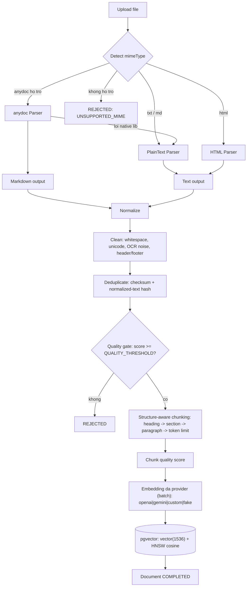
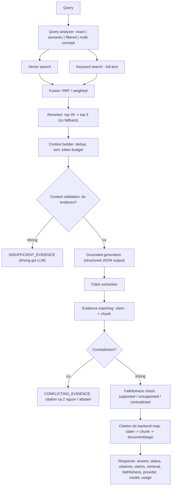

# Kiến trúc RAG Reliability Service

> Tài liệu này mô tả kiến trúc tổng thể và triết lý thiết kế. Chi tiết từng
> thành phần (cleaning, chunking, retrieval, grounding, evaluation…) sẽ được
> bổ sung theo từng phase (xem `PROMPT.md §47`).

## 1. Triết lý

RAG **không** nhằm mục tiêu "LLM luôn trả lời". Mục tiêu là:

> LLM trả lời **đúng khi có evidence** và **biết từ chối khi không có evidence**.

Khi knowledge base không chứa thông tin, hệ thống phải trả về
`INSUFFICIENT_EVIDENCE` — không đoán, không bịa, không suy luận vượt evidence,
không tạo citation giả.

Mọi tối ưu phải được chứng minh bằng số liệu (baseline → experiment →
regression), không nói "cách này tốt hơn" mà phải "Recall@5 tăng X→Y,
Faithfulness tăng A→B, latency +C ms, cost +D%".

## 2. Trạng thái theo phase

| Phase | Nội dung                                                                                                    | Trạng thái    |
| ----- | ----------------------------------------------------------------------------------------------------------- | ------------- |
| 0     | Bootstrap: Nest · Prisma 7 · PostgreSQL · pgvector · Docker · config · health · multi-provider LLM · anydoc | ✅ Hoàn thành |
| 1     | Ingestion: parsing, normalize, cleaning, dedup, quality score, API upload/CRUD                              | ✅ Hoàn thành |
| 2     | Chunking: structure-aware (Markdown) + fixed (baseline) + chunk quality + API                               | ✅ Hoàn thành |
| 3     | Embedding đa provider (batch) + pgvector + HNSW index + API                                                 | ✅ Hoàn thành |
| 4     | Baseline RAG (fixed chunk + vector search + prompt đơn giản) + evaluation                                   | ⏳            |
| 5     | Retrieval nâng cao: metadata filter, keyword, hybrid, fusion                                                | ⏳            |
| 6     | Reranking + benchmark before/after                                                                          | ⏳            |
| 7     | Grounded generation + abstention                                                                            | ⏳            |
| 8     | Citation: claim → evidence → chunk → document                                                               | ⏳            |
| 9     | Faithfulness: claim extraction, evidence matching, contradiction                                            | ⏳            |
| 10    | Evaluation framework: golden dataset, metrics, experiments                                                  | ⏳            |
| 11    | Regression + observability                                                                                  | ⏳            |
| 12    | Benchmark đa provider (quality / cost / latency)                                                            | ⏳            |

## 3. Cấu trúc module

```
src/
├── config/         # ConfigModule + validate env bằng Zod (env.schema.ts)
├── database/        # PrismaService (Prisma 7 + driver adapter @prisma/adapter-pg)
├── documents/       # upload/CRUD tài liệu + parsers (anydoc + fallback)
├── rag/ingestion/   # normalize · clean · dedup · quality · orchestrator
├── rag/chunking/    # structure-aware | fixed · chunk quality · factory
├── rag/embedding/   # orchestrator (chunk→pgvector) + kiểm tra vector schema
├── ai/
│   ├── llm/         # LLMProvider interface + 4 provider (openai|gemini|anthropic|custom)
│   ├── embeddings/  # EmbeddingProvider interface + 4 provider (openai|gemini|custom|fake)
│   ├── reranking/   # RerankerProvider interface (hiện thực ở PHASE 6)
│   └── tokenizer/   # đếm token (js-tiktoken)
├── documents/parsers/  # anydoc (chính) + plaintext/html (fallback)
├── common/         # errors, types (pipeline contracts §53), utils, constants
└── health/         # /health (db + pgvector), /health/live
```

## 4. Pipeline ingestion tài liệu (mục tiêu — hiện thực dần từ PHASE 1)



## 5. Pipeline truy vấn RAG (`POST /rag/query` — hiện thực từ PHASE 4)



## 6. Failure handling (PROMPT §54)

| Stage             | Khi lỗi                                                                                                                                                        |
| ----------------- | -------------------------------------------------------------------------------------------------------------------------------------------------------------- |
| Parser (anydoc)   | thử fallback parser → vẫn lỗi → `INGESTION_FAILED` với lý do cụ thể (`NEEDS_OCR`, `ENCRYPTED`, `MALFORMED`…)                                                   |
| Quality gate      | `REJECTED`                                                                                                                                                     |
| Embedding         | provider chưa cấu hình → bỏ qua (dừng `CHUNKING`); số chiều lệch → `INGESTION_PRECONDITION`; API lỗi → retry giới hạn rồi ném (giữ `EMBEDDING`, re-embed được) |
| Vector search     | fallback keyword nếu phù hợp                                                                                                                                   |
| Reranker          | fallback ranking (giữ thứ tự fusion)                                                                                                                           |
| LLM               | phân loại lỗi (`RATE_LIMIT`, `OVERLOADED`, `SAFETY_BLOCK`…), retry lỗi tạm thời, (tương lai) fallback provider                                                 |
| Faithfulness fail | regenerate hoặc abstain                                                                                                                                        |

Không stage nào được che giấu lỗi.

## 7. Observability (PROMPT §38)

Mỗi truy vấn RAG sẽ trace: query analysis → vector/keyword retrieval → fusion →
reranking → context → generation → claims → evidence matching → faithfulness →
citations → response, kèm latency, token usage, estimated cost, retrieval
scores, số chunk, context tokens, model, provider, errors. Không log API key,
password, secrets. Tận dụng LangChain callbacks nơi phù hợp.

## 8. Cách benchmark (PROMPT §35–37, §59)

1. Chạy **baseline** (fixed chunking + vector search + prompt đơn giản), lưu
   metrics (Recall@5, MRR, NDCG, Faithfulness, Hallucination Rate…).
2. Mỗi cải tiến = một **experiment** với config / dataset version / metrics /
   latency / token / cost / provider + model được ghi lại.
3. **Regression**: `npm run evaluate` so sánh CURRENT vs BASELINE; nếu metric
   giảm quá ngưỡng (vd Recall -5%, Hallucination +3%) → FAIL CI.
