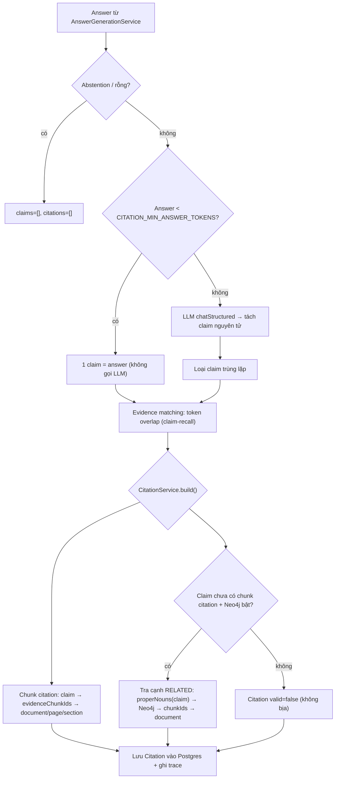

# Citation cấp claim (PHASE 9)

> Pipeline: answer → claim extraction (LLM) → evidence matching (lexical) →
> citation build (chunk + relationship) → persist. Backend quản lý citation ID
> — **không tin LLM tự cấp** (PROMPT §29).

## 1. Tổng quan

Mỗi câu trả lời RAG được tách thành các **claim nguyên tử**, từng claim được
đối chiếu với chunk ngữ cảnh (evidence matching), sau đó map sang tài liệu
nguồn (citation). Kết quả gồm:

- `claims: VerifiedClaim[]` — danh sách claim kèm verdict (`SUPPORTED` /
  `UNSUPPORTED`).
- `citations: Citation[]` — mỗi citation trỏ claim → chunk → document
  (page/section), hoặc claim → relationship entity → document.

Bật/tắt bằng `RAG_CITATION_ENABLED` (mặc định `true`). Khi tắt, pipeline dùng
citation baseline (P4): map thô `usedContext` → chunk → document.

## 2. Luồng xử lý



## 3. Claim Extraction (`ClaimExtractorService`)

**File**: `src/rag/grounding/claim-extractor.service.ts`

- **LLM structured output**: `{ claims: [{ text: string }] }` — dùng
  `LlmService.chatStructured` với schema Zod, system prompt tiếng Việt.
- **ID do backend cấp**: `c1`, `c2`, ... — không bao giờ tin nhãn LLM tạo (§29).
- **Tối ưu chi phí**:
  - Answer rỗng / abstention → `claims: []`, method `skipped` (không gọi LLM).
  - Answer ngắn (< `CITATION_MIN_ANSWER_TOKENS`, mặc định 6) → 1 claim = chính
    answer, method `fallback-single`.
  - LLM trả 0 claim cho answer có nội dung → fallback 1 claim.
- **Dedup**: chuẩn NFC, lowercase, collapse whitespace trước so sánh.

## 4. Evidence Matching (`EvidenceMatcherService`)

**File**: `src/rag/grounding/evidence-matcher.service.ts`

Hàm thuần (deterministic, không gọi LLM, cực nhanh).

- **Token overlap (claim-recall)**:
  $$\text{score} = \frac{|\text{claimTokens} \cap \text{chunkTokens}|}{|\text{claimTokens}|}$$
- Bỏ stopword tiếng Việt, ký tự đặc biệt qua `contentTokens()`.
- Ngưỡng: `CITATION_MIN_OVERLAP` (mặc định 0.5).
- Tối đa chunk/claim: `CITATION_MAX_PER_CLAIM` (mặc định 3).
- **Context prior boost**: chunk nằm trong `usedContextChunkIds` (LLM khai đã
  dùng) được hạ ngưỡng xuống `minOverlap × 0.6`.
- Sắp xếp theo overlap giảm dần; tie-break giữ thứ tự ban đầu.

## 5. Citation Build (`CitationService`)

**File**: `src/rag/grounding/citation.service.ts`

### 5.1. Chunk citation (`kind: 'chunk'`)

Claim có evidence `supported: true` + `evidenceChunkIds` → trích xuất
`documentId`, `chunkId`, `page`, `section` từ chunk ngữ cảnh.

### 5.2. Relationship citation (`kind: 'relationship'`)

Khi claim chưa có chunk citation + `CITATION_RELATIONSHIP_ENABLED=true` + Neo4j
sống:

1. Rút danh từ riêng từ claim text (`properNouns()`, ≥ 2 từ).
2. Query Neo4j: `(:Entity)-[r:RELATED]-(:Entity)` với `toLower(name) IN $names`.
3. Ưu tiên cạnh có `chunkId` nằm trong ngữ cảnh đã dùng.
4. Trả citation với `sourceEntity`, `targetEntity`, `relationType`.

**Giới hạn**: tối đa `MAX_RELATIONSHIP_LOOKUPS = 12` query Neo4j/request (tránh
bùng nổ chi phí).

### 5.3. Claim không căn cứ

Trả `Citation` với `valid: false`, `documentId: ''`, `chunkId: ''`. **Tuyệt đối
không bịa citation ID** — đếm vào `stats.invalidClaims`.

## 6. Cấu hình

| Biến môi trường                | Mặc định | Mô tả                                                     |
| ------------------------------ | -------- | ---------------------------------------------------------- |
| `RAG_CITATION_ENABLED`         | `true`   | Bật pipeline citation cấp claim (tắt = baseline P4)       |
| `CITATION_MIN_OVERLAP`         | `0.5`    | Ngưỡng token overlap tối thiểu để coi là supported         |
| `CITATION_MAX_PER_CLAIM`       | `3`      | Số chunk evidence tối đa cho mỗi claim                     |
| `CITATION_RELATIONSHIP_ENABLED`| `true`   | Thử map claim → cạnh RELATED trong Neo4j                   |
| `CITATION_MIN_ANSWER_TOKENS`   | `6`      | Ngưỡng token answer để quyết định gọi LLM hay fallback     |

Override per-request: trường `cite: boolean` trong body `POST /rag/query`.

## 7. Response shape

```jsonc
{
  "status": "GROUNDED",
  "answer": "Sinh viên được bảo lưu tối đa hai học kỳ ...",
  "claims": [
    {
      "id": "c1",
      "text": "Sinh viên được bảo lưu tối đa hai học kỳ liên tiếp.",
      "supported": true,
      "verdict": "SUPPORTED",
      "evidenceChunkIds": ["chunk-abc"]
    },
    {
      "id": "c2",
      "text": "Phải nộp đơn trước ít nhất 15 ngày.",
      "supported": true,
      "verdict": "SUPPORTED",
      "evidenceChunkIds": ["chunk-abc"]
    }
  ],
  "citations": [
    {
      "claimId": "c1",
      "claimText": "Sinh viên được bảo lưu tối đa hai học kỳ liên tiếp.",
      "kind": "chunk",
      "documentId": "doc-xyz",
      "chunkId": "chunk-abc",
      "page": 3,
      "section": "Điều 5",
      "valid": true
    }
    // ...
  ],
  "faithfulness": null  // → P10
}
```

## 8. Benchmark

`POST /evaluation/benchmark-citation` — chạy golden dataset 2 lần (citation
off → on), trả metrics before/after + delta. Metrics bổ sung khi citation bật:

- `claimSupportRate`: tỉ lệ claim được ít nhất 1 chunk hỗ trợ.
- `citationValidRate`: tỉ lệ citation có `valid: true`.
- `citationAccuracy`: tỉ lệ citation trỏ đúng tài liệu gold.

## 9. Database

Model `Citation` trong Prisma (`prisma/schema.prisma`):

| Cột              | Kiểu           | Ghi chú                                    |
| ---------------- | -------------- | ------------------------------------------- |
| `id`             | `String @id`   | CUID tự sinh                                |
| `ragQueryId`     | `String`       | FK → `RagQuery`, cascade delete             |
| `claimId`        | `String`       | ID backend cấp (`c1`, `c2`, ...)            |
| `claimText`      | `String`       | Nội dung claim                               |
| `kind`           | `String`       | `'chunk'` hoặc `'relationship'`             |
| `documentId`     | `String?`      | FK → `Document` (nullable nếu không khớp)   |
| `chunkId`        | `String?`      | FK → `DocumentChunk` (nullable)              |
| `page`           | `Int?`         | Trang (nếu chunk có metadata)                |
| `section`        | `String?`      | Mục/heading                                  |
| `sourceEntity`   | `String?`      | Chỉ khi `kind='relationship'`                |
| `targetEntity`   | `String?`      | Chỉ khi `kind='relationship'`                |
| `relationType`   | `String?`      | Loại quan hệ (PARTNERSHIP, ...)              |
| `valid`          | `Boolean`      | Backend map được → `true`; không → `false`   |

`RagQuery.claims` (Json) lưu `VerifiedClaim[]` phục vụ audit.

## 10. Test coverage

- `citation.service.spec.ts` — 6 tests (chunk, unsupported, multi-chunk, missing
  chunk, Neo4j relationship, Neo4j error).
- `claim-extractor.service.spec.ts` — 7 tests (multi-claim, empty, abstention,
  short fallback, LLM empty, dedup, fake provider).
- `evidence-matcher.service.spec.ts` — 10 tests (pure function, score, stopword,
  multi-chunk ranking, tie-break, context prior, config, determinism).
- `rag-pipeline.service.spec.ts` — 5 tests chuyên P9 (cite=true, cite=false,
  INSUFFICIENT_EVIDENCE, valid=false, usage aggregation).
