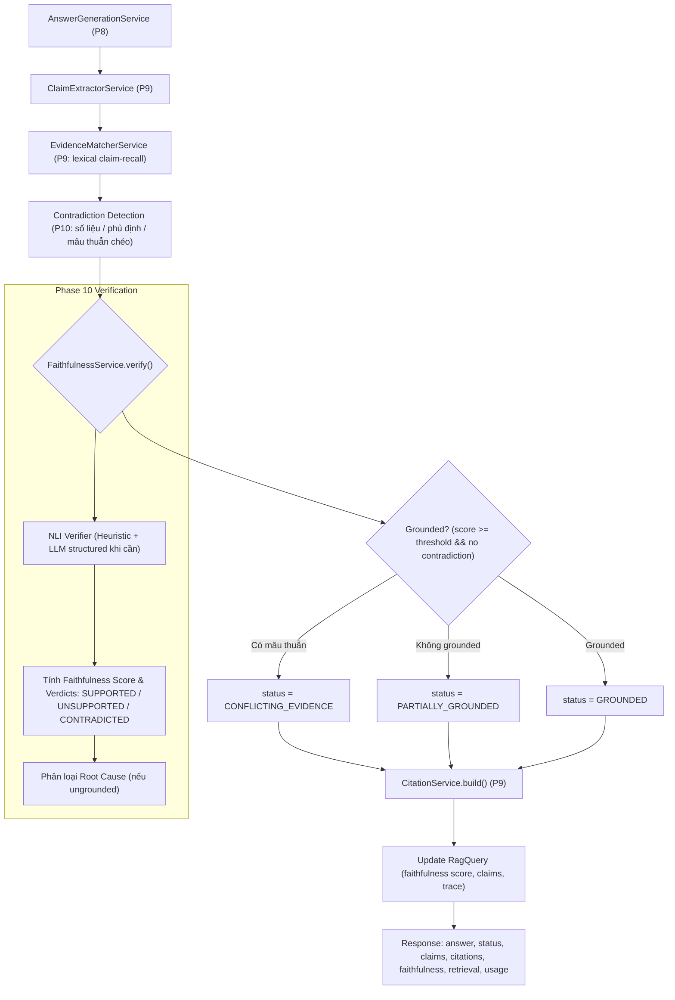

# Faithfulness & Contradiction Detection (PHASE 10)

> Đánh giá tính trung thực cấp claim: answer → claim extraction → evidence matching
> → contradiction detection (NLI) → faithfulness verification → root cause classification
> (PROMPT §26, §27, §28).

## 1. Tổng quan

Mục tiêu của RAG Reliability không chỉ là trả lời câu hỏi mà là **trung thực tuyệt đối
với ngữ cảnh (grounded in context)** và **từ chối khi thiếu thông tin hoặc phát hiện mâu thuẫn**.

Phase 10 bổ sung:
- **Contradiction Detection** (`contradiction-detector.ts`): Nhận diện mâu thuẫn số liệu, phủ định trực tiếp giữa claim và chunk hoặc giữa các chunk ngữ cảnh với nhau.
- **Faithfulness Service** (`faithfulness.service.ts`): Tính điểm Faithfulness Score cấp claim và gán nhãn 3 trạng thái: `SUPPORTED`, `UNSUPPORTED`, `CONTRADICTED`.
- **Phân loại nguyên nhân lỗi (Hallucination Root Cause)** theo 7 tầng phân cấp (PROMPT §28).
- **Tích hợp Pipeline RAG**: Ghi nhận `faithfulness: FaithfulnessResult`, cập nhật trạng thái `RagStatus` (`CONFLICTING_EVIDENCE`, `PARTIALLY_GROUNDED`, `GROUNDED`).
- **Benchmark Endpoint**: `POST /evaluation/benchmark-faithfulness`.

## 2. Luồng xử lý (Workflow)



## 3. Quy tắc Đánh giá và Phân loại

### 3.1. Ba nhãn Verdict cho Claim
1. **`SUPPORTED`**: Khẳng định được chứng minh đầy đủ bởi ít nhất một đoạn ngữ cảnh.
2. **`UNSUPPORTED`**: Ngữ cảnh không nhắc tới hoặc không đủ thông tin (hallucination phát sinh).
3. **`CONTRADICTED`**: Khẳng định mâu thuẫn trực tiếp (số liệu khác biệt, phủ định ngược) với ngữ cảnh.

### 3.2. Công thức Faithfulness Score
$$\text{Faithfulness Score} = \max\left(0, \min\left(1, \frac{N_{\text{supported}} - 2 \times N_{\text{contradicted}}}{N_{\text{total}}}\right)\right)$$

Điều kiện coi là **`grounded = true`**:
$$\text{score} \ge \text{FAITHFULNESS\_THRESHOLD} \quad \text{và} \quad N_{\text{contradicted}} = 0 \quad \text{và không có mâu thuẫn chéo ngữ cảnh}$$

### 3.3. Phân loại 7 Tầng Lỗi Gốc (PROMPT §28)

| Tầng Lỗi | Điều kiện xác định |
| :--- | :--- |
| `RETRIEVAL_FAILURE` | Không tìm thấy chunk nào hoặc thiếu hoàn toàn tài liệu liên quan |
| `CONFLICTING_CONTEXT` | Các chunk được truy hồi mang thông tin mâu thuẫn nhau |
| `IRRELEVANT_CONTEXT` | Chunk truy hồi có điểm relevance quá thấp (< 0.3) |
| `GENERATION_HALLUCINATION` | Ngữ cảnh đủ nhưng LLM tự bịa thông tin hoặc sinh claim mâu thuẫn |
| `MISSING_CONTEXT` | Ngữ cảnh liên quan nhưng thiếu chi tiết để trả lời trọn vẹn |
| `CITATION_HALLUCINATION` | Claim đúng nhưng trích dẫn sai chunk / citation không tồn tại |
| `BAD_SOURCE_DATA` | Dữ liệu nguồn bị lỗi OCR / format hỏng |

## 4. Cấu hình Môi trường

| Biến môi trường | Mặc định | Ý nghĩa |
| :--- | :--- | :--- |
| `RAG_FAITHFULNESS_ENABLED` | `true` | Bật pipeline kiểm chứng faithfulness & mâu thuẫn |
| `FAITHFULNESS_VERIFIER_MODE` | `auto` | Chế độ verifier: `auto` (hybrid), `heuristic` (nhanh, 0 token), `llm` (NLI toàn phần) |
| `FAITHFULNESS_THRESHOLD` | `0.8` | Ngưỡng điểm để coi câu trả lời là grounded |
| `RAG_REGENERATE_ON_UNFAITHFUL` | `true` | Tự động sinh lại tối đa 1 lần nếu câu trả lời unfaithful |

## 5. Cấu trúc Response `POST /rag/query`

```jsonc
{
  "status": "GROUNDED",
  "answer": "Sinh viên được phép bảo lưu tối đa hai học kỳ liên tiếp...",
  "claims": [
    {
      "id": "c1",
      "text": "Sinh viên được phép bảo lưu tối đa hai học kỳ liên tiếp.",
      "supported": true,
      "verdict": "SUPPORTED",
      "evidenceChunkIds": ["chunk-1"]
    }
  ],
  "citations": [
    {
      "claimId": "c1",
      "claimText": "Sinh viên được phép bảo lưu tối đa hai học kỳ liên tiếp.",
      "kind": "chunk",
      "documentId": "doc-1",
      "chunkId": "chunk-1",
      "valid": true
    }
  ],
  "faithfulness": {
    "score": 1.0,
    "grounded": true,
    "claims": [
      {
        "claimId": "c1",
        "supported": true,
        "evidenceChunkIds": ["chunk-1"],
        "verdict": "SUPPORTED",
        "score": 0.95
      }
    ]
  },
  "retrieval": { "strategy": "vector", "chunkCount": 3, "topScore": 0.95, "chunks": [...] },
  "usage": { "inputTokens": 120, "outputTokens": 45, "embeddingTokens": 12, "estimatedCost": 0.0001 }
}
```

## 6. Benchmark Endpoint

- **Endpoint**: `POST /evaluation/benchmark-faithfulness`
- **Body**: `{ "datasetName": "answerable", "topK": 5 }`
- **Chức năng**: Chạy dataset 2 lần (`faithfulness: false` vs `faithfulness: true`), tính toán delta các chỉ số `faithfulness`, `claimLevelHallucinationRate`, `passRate`, `avgLatencyMs`, `totalCost`.
